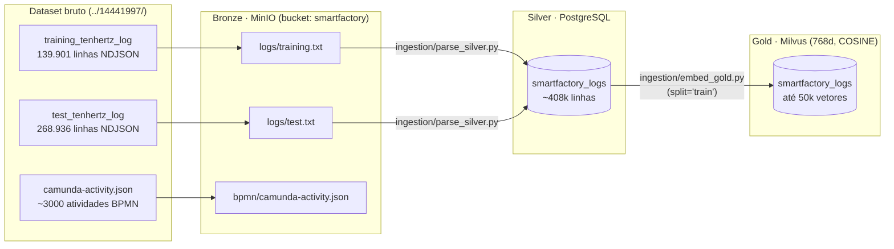

# Hierarquia dos Dados — Smart Factory Logs (TCC AIOps Industry)

Documento conceitual do **Passo 0** da metodologia RAG. Mapeia a origem,
a transformação e o consumo dos dados industriais usados pelo sistema.
Quem ler este doc deve conseguir, sem outras referências, escrever uma
query SQL razoável em `smartfactory_logs` e entender o que cada vetor
do Milvus representa.

---

## 1. Lineage Bronze → Silver → Gold



| Camada | Tecnologia | Path / target | Script | Make target |
|---|---|---|---|---|
| Bronze | MinIO (S3-compat) | `s3://smartfactory/logs/{training,test}.txt` | `ingestion/upload_bronze.py` | `make ingest-bronze` |
| Silver | PostgreSQL 16 | tabela `smartfactory_logs` | `ingestion/parse_silver.py` | `make ingest-silver` |
| Gold | Milvus 2.x | collection `smartfactory_logs` | `ingestion/embed_gold.py` | `make embed` |

Pipeline completo (DDL + Bronze + Silver) é orquestrado por `make ingest-all`
(`Makefile:58`). A camada Gold roda separada porque depende do `fastembed`
(modelo ~400MB de download na primeira execução).

---

## 2. As 7 estações da fábrica inteligente

A planta simulada do dataset 14441997 (Smart Factory Logs) tem **7 estações**
de produção que cooperam no fluxo de uma peça (workpiece). Os códigos
abaixo aparecem literalmente no campo `station` de cada evento de log:

| `station` | Nome | Papel no processo |
|---|---|---|
| `VGR_1` | Vacuum Gripper Robot | Captura a peça do depósito (HBW) e entrega na primeira estação de processamento. |
| `HBW_1` | High Bay Warehouse | Armazenamento vertical das peças cruas. Sai/entra pela ação do VGR. |
| `MM_1` | Multi-Processing Station | Conjunto forno + serra. Processa a peça (aquece, corta). |
| `OV_1` | Oven | Forno componente do MM. Tem eventos próprios porque controla temperatura. |
| `SM_1` | Sorting Machine | Esteira de separação por cor. Despacha a peça para destino correto. |
| `EC_1` | Environment Sensor | Telemetria ambiente (temperatura/luz/umidade). Não move peças. |
| `WT_1` | Workpiece Transport | Esteira de transporte entre estações. |

Frequência de amostragem: **10 Hz** (um evento a cada ~100 ms por estação,
quando a estação está ativa). Por isso o volume bruto chega em centenas de
milhares de linhas em poucas horas de gravação.

---

## 3. Schema do log NDJSON (entrada)

Cada linha dos arquivos `*.txt` é um JSON independente (formato **NDJSON**).
Exemplo de evento:

```json
{
  "id": "83b5b5ef-389b-4ef0-80a3-dfa87b7da537",
  "station": "MM_1",
  "timestamp": "2023-04-11 09:57:48.72",
  "current_state": "ready",
  "current_task": "",
  "current_task_duration": 0.0,
  "current_sub_task": "",
  "i1_pos_switch": 1,
  "i2_pos_switch": 0
}
```

Os parsers separam dois grupos de campos
(`ingestion/parse_silver.py:39-97`):

### 3a. Campos fixos (colunas dedicadas)

Definidos em `_KNOWN_FIELDS` (`parse_silver.py:39`) e mapeados na DDL
`ingestion/create_tables.sql`:

| Campo NDJSON | Coluna Silver | Tipo SQL | Notas |
|---|---|---|---|
| `id` | `id` | `VARCHAR(36)` PK | UUID v4. |
| `station` | `station` | `VARCHAR(20)` | Um dos 7 códigos acima. |
| `timestamp` | `event_timestamp` | `TIMESTAMP` | Granularidade 10ms. |
| `current_state` | `current_state` | `VARCHAR(20)` | `"ready"` ou `"not ready"`. |
| `current_task` | `current_task` | `TEXT` | String descritiva da tarefa. Pode ser `""`. |
| `current_task_duration` | `current_task_duration` | `FLOAT` | Segundos decorridos na sub-task atual. |
| `current_sub_task` | `current_sub_task` | `TEXT` | Etapa fina dentro da tarefa. |

### 3b. Campos variáveis (coluna `sensors JSONB`)

Tudo que **não** está em `_KNOWN_FIELDS` é serializado e armazenado em
`sensors` (`parse_silver.py:85`). Variam por estação:

- **VGR/HBW/SM/WT**: `i1_pos_switch`, `i2_pos_switch`, ... (sensores
  digitais de fim-de-curso e presença).
- **MM/OV**: leituras analógicas (temperatura, posição, etc.).
- **EC_1**: temperatura ambiente, umidade relativa, luminosidade.

Como o conjunto exato muda por estação, manter em JSONB evita schema
explosion. Os sensores que mudam durante um episódio são extraídos em
`ingestion/parse_episodes.py` (campo `sensors_changed`).

### 3c. Coluna de controle de split

A coluna `split VARCHAR(10)` (não vem do NDJSON) é injetada pelo parser
conforme o arquivo de origem (`parse_silver.py:53-56`):

| Arquivo de origem | `split` | Linhas |
|---|---|---|
| `s3://smartfactory/logs/training.txt` | `'train'` | 139.901 |
| `s3://smartfactory/logs/test.txt` | `'test'` | 268.936 |

Use `WHERE split = 'train'` para consultas ML/RAG. O `split = 'test'`
fica reservado para o conjunto de avaliação fora-de-amostra.

---

## 4. Semântica de `current_state` e detecção de anomalia

`current_state` é binário: `"ready"` (operação nominal) ou `"not ready"`
(estação ocupada ou em falha). A detecção de **anomalia** é feita no nível de
**episódio** (`ingestion/parse_episodes.py`), não de evento isolado:

> Um episódio `not ready` é anômalo quando sua **duração** excede
> `mediana + 3·MAD` da sua sub-tarefa **e** ultrapassa a mediana em pelo
> menos 2s (piso absoluto, evita falsos alarmes onde MAD ≈ 0).

A estatística (mediana e MAD) é calculada por `current_sub_task`, porque a
duração normal varia muito entre sub-tarefas. Episódios anômalos recebem
`is_anomaly = True` na tabela `smartfactory_episodes`.

---

## 5. Silver → Gold: o que vai para o Milvus

`ingestion/embed_gold.py` lê apenas eventos `split='train'`
(`embed_gold.py:86-103`) e gera embeddings 768d com
**`nomic-ai/nomic-embed-text-v1.5`** (via `fastembed`).

O texto que vira vetor é montado em `_build_log_text`
(`embed_gold.py:181-194`):

```
search_document: Station MM_1 | 2023-04-11 09:57:48 | State: not ready
                | Task: Process workpiece | Sub-task: Heating
                | Duration: 12.430s
```

Prefixo `search_document:` é convenção do nomic para distinguir
documentos indexados de queries de busca. O retriever
(`rag/retriever.py`) usa o prefixo simétrico `search_query:` na hora de
embeddar a pergunta.

Schema Milvus (`embed_gold.py:127-138`):

| Campo | Tipo | Notas |
|---|---|---|
| `event_id` | VARCHAR(36) PK | mesma UUID do Silver |
| `station` | VARCHAR(20) | |
| `event_timestamp` | VARCHAR(30) | armazenado como string |
| `current_state` | VARCHAR(20) | |
| `current_task` | VARCHAR(500) | |
| `current_sub_task` | VARCHAR(300) | |
| `log_text` | VARCHAR(1000) | o texto bruto que foi embedado |
| `embedding` | FLOAT_VECTOR(768) | índice IVF_FLAT, métrica COSINE, nlist=128 |

**Cap de volume**: variável `EMBED_LIMIT` (default 50.000;
`embed_gold.py:49`). Amostragem aleatória com `random_state=42`
quando o universo passa do cap.

---

## 6. Schema do `camunda-activity.json` (referência)

Não consumido pelos passos 0-3 do TCC, mas vive em `s3://smartfactory/bpmn/`
para futuros joins processo-vs-log. Estrutura básica:

```json
{
  "activityId": "Task_pickup_workpiece",
  "processDefinitionKey": "smart_factory_main_process",
  "startTime": "2023-04-11T09:57:48.72Z",
  "endTime":   "2023-04-11T09:58:00.10Z",
  "durationInMillis": 11380
}
```

Cada registro representa uma atividade BPMN executada pelo engine
Camunda que orquestra a fábrica. Joins potenciais:
`activity.startTime ≤ log.event_timestamp ≤ activity.endTime`.

---

## 7. Convenções de uso (cheat sheet)

| Quero... | Caminho |
|---|---|
| Contar eventos por split | `SELECT split, COUNT(*) FROM smartfactory_logs GROUP BY split;` |
| Top anomalias | `WHERE current_state='not ready' ORDER BY current_task_duration DESC LIMIT 25` |
| Filtrar uma estação | `WHERE station = 'MM_1'` |
| Acessar sensores | `sensors->>'i1_pos_switch'` (texto) ou `(sensors->>'i1_pos_switch')::int` |
| Buscar logs similares no Milvus | `rag.retriever.retrieve(query, top_k=5)` |
| Pipeline RAG completo | `rag.pipeline.run(query)` ou `make rag-query QUERY="..."` |

---

## 8. Glossário

- **NDJSON** — Newline-Delimited JSON. Um objeto por linha, sem
  vírgulas separando-os. Permite leitura streaming.
- **BPMN / Camunda** — Notação de Modelagem de Processos de Negócio /
  engine que executa os processos. No dataset, orquestra o fluxo de
  produção entre as 7 estações.
- **Workpiece** — Peça em processamento na fábrica simulada.
- **COSINE / IVF_FLAT** — Métrica de similaridade (cosseno) e
  estrutura de índice (inverted file flat) usados no Milvus.
- **nomic-embed-text-v1.5** — Modelo de embedding 768d open-source
  (Apache 2.0), local via fastembed — não depende de API externa.
- **search_document / search_query** — Prefixos do nomic para
  diferenciar contexto de indexação vs busca.
- **Silver / Gold** — Convenção Medallion (Databricks): Bronze = raw,
  Silver = limpo/normalizado, Gold = pronto para consumo
  analítico/RAG (aqui, os episódios).
- **Episódio** — Sequência contínua de eventos com mesma `station`,
  `current_task`, `current_sub_task` e `current_state`. Unidade da camada
  Gold; ver `ingestion/parse_episodes.py`.
